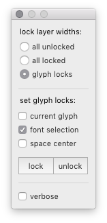
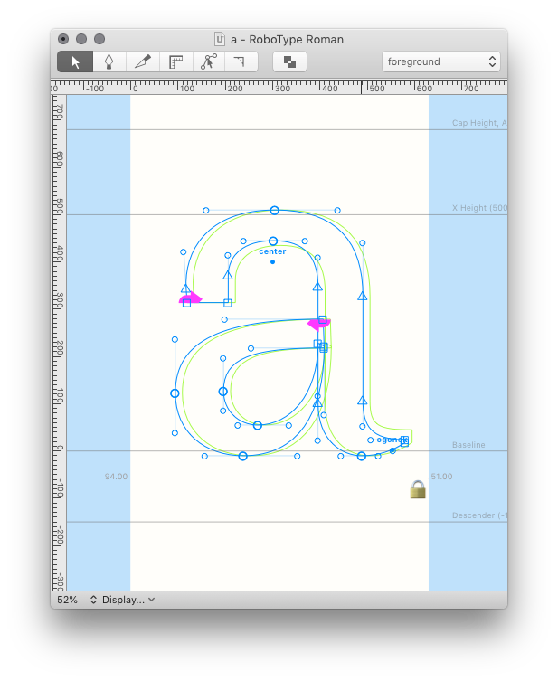
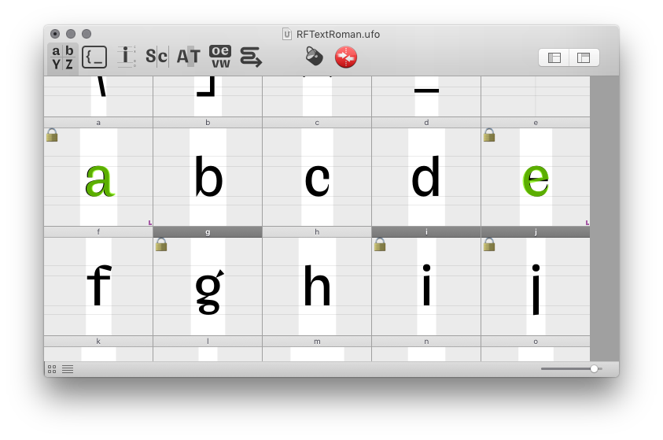
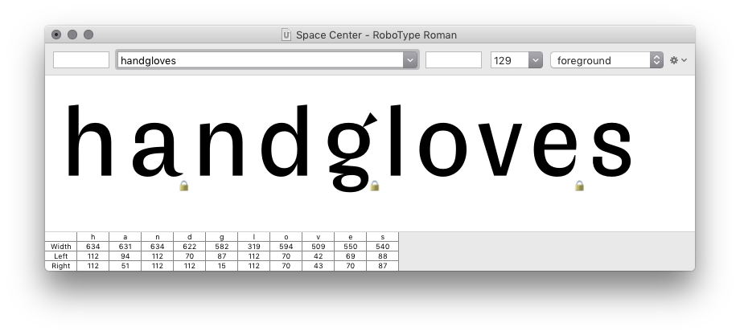

Lock Glyph Layers
=================

A tool to lock layer widths while editing glyphs in RoboFont.

*…work in progress…*

Introduction
------------

In RoboFont 1, all layers of a glyph had the same width. RoboFont 3 introduced UFO3 and the ability to have glyph layers with different widths.

This tool brings the old RF1 “locked widths” behavior to RF3, and introduces a third mode to allow a mixture of locked/unlocked glyphs in the same font.

The tool works by adding an observer for changes to glyph widths (in any layer) and propagates these changes to all the other layers in the same glyph.

Modes
-----

all unlocked
: Default RoboFont 3 behavior (the tool is off). All glyph layer widths can be edited independently.

all locked
: Replicates RoboFont 1 behavior: all layers of a glyph have the same width. This is a global setting for all glyphs in all fonts.

glyph locks
: Allows both locked and unlocked glyphs in the same font. Glyphs can be locked/unlocked individually using the tool. The lock statuses are stored in the font lib.

Workflow
--------

1. Open the tool and choose one of the lock modes: *all unlocked*, *all locked* or *glyph locks*.

    

2. When working in *glyph locks* mode: use the lock/unlock buttons to set lock status for selected glyphs.

3. If the layer widths of a glyph are locked, a closed lock icon 🔒 will be shown when previwing a glyph in the Glyph Window, Font Overview and Space Center.

    

    

    

3. When the width of a glyph changes (in any layer), the new width is copied to all other layers of the glyph.

To Do
-----

- At the moment it is necessary to keep the dialog open while editing, which is not very practical. The observers should continue working after the window is closed.

- Lock mode should be saved in the font too? (not jut glyph-level locks)

- Add an option to turn lock icon off but keep the tool working.

- Convert to extension & publish on Mechanic.

